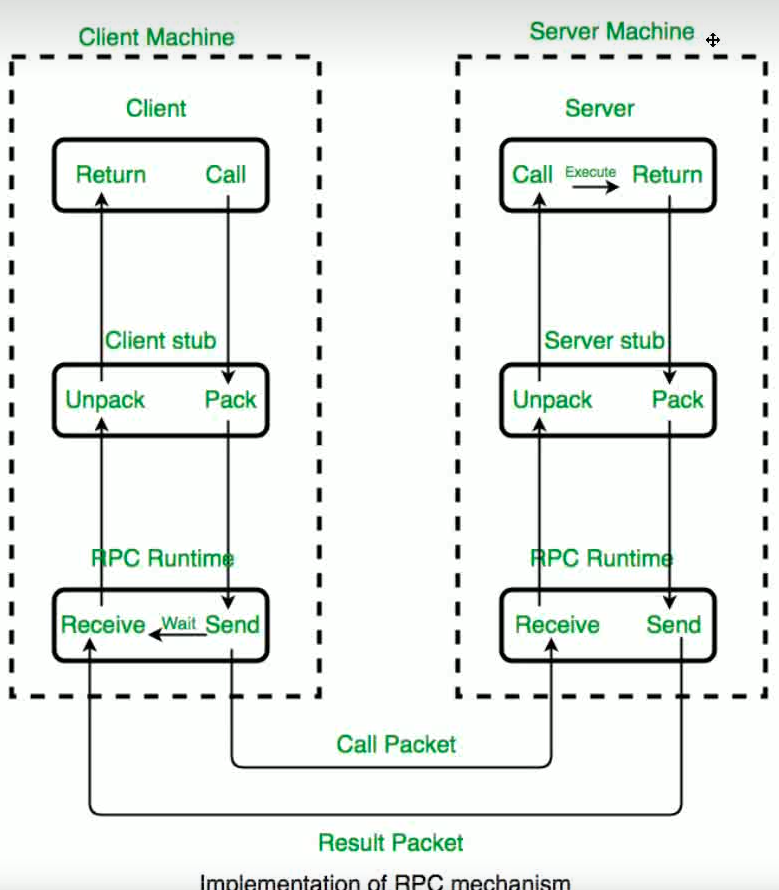

# 在erlang服务器开发的选择上其实有比较多的悬着

[cowboy](https://github.com/ninenines/cowboy)

[yaws](https://github.com/erlyaws/yaws)
历史悠久的大哥，但是不太容易编译

[cowboy](https://github.com/mochi/mochiweb)


## 用cowboy，这是相关文档以及模块函数定义


https://ninenines.eu/docs/en/cowboy/2.12/manual/

### 从helloworld开始

```erlang
start(_Type, _Args) ->
	Dispatch = cowboy_router:compile([
		{'_', [
			{"/", toppage_h, []}
		]}
	]),
	{ok, _} = cowboy:start_clear(http, [{port, 8080}], #{
		env => #{dispatch => Dispatch}
	}),
	hello_world_sup:start_link().

stop(_State) ->
	ok = cowboy:stop_listener(http).

% toppage_h
init(Req, Opts) ->
	{cowboy_rest, Req, Opts}.

content_types_provided(Req, State) ->
	{[
		{<<"text/html">>, hello_to_html},
		{<<"application/json">>, hello_to_json},
		{<<"text/plain">>, hello_to_text}
	], Req, State}.

hello_to_html(Req, State) ->
	Body = <<"<html>
<head>
	<meta charset=\"utf-8\">
	<title>REST Hello World!</title>
</head>
<body>
	<p>REST Hello World as HTML!</p>
</body>
</html>">>,
	{Body, Req, State}.

hello_to_json(Req, State) ->
	Body = <<"{\"rest\": \"Hello World!\"}">>,
	{Body, Req, State}.

hello_to_text(Req, State) ->
	{<<"REST Hello World as text!">>, Req, State}.

```
流程在这，有空研究
https://ninenines.eu/docs/en/cowboy/2.12/guide/rest_flowcharts/
https://ninenines.eu/docs/en/cowboy/2.12/manual/cowboy_websocket/
https://ninenines.eu/docs/en/cowboy/2.12/manual/cowboy_stream


### 先了解RPC





### 这里mark一下gen-server模版

``` erlang
-module(rpc_client).
-behaviour(gen_server).
-export([init/1, handle_call/3, handle_cast/2, handle_info/2, terminate/2, code_change/3]).

%% ====================================================================
%% API functions
%% ====================================================================
-export([]).


%% ====================================================================
%% Behavioural functions
%% ====================================================================
-record(state, {}).

%% init/1
%% ====================================================================
%% @doc <a href="http://www.erlang.org/doc/man/gen_server.html#Module:init-1">gen_server:init/1</a>
-spec init(Args :: term()) -> Result when
    Result :: {ok, State}
            | {ok, State, Timeout}
            | {ok, State, hibernate}
            | {stop, Reason :: term()}
            | ignore,
    State :: term(),
    Timeout :: non_neg_integer() | infinity.
%% ====================================================================
init([]) ->
    {ok, #state{}}.


%% handle_call/3
%% ====================================================================
%% @doc <a href="http://www.erlang.org/doc/man/gen_server.html#Module:handle_call-3">gen_server:handle_call/3</a>
-spec handle_call(Request :: term(), From :: {pid(), Tag :: term()}, State :: term()) -> Result when
    Result :: {reply, Reply, NewState}
            | {reply, Reply, NewState, Timeout}
            | {reply, Reply, NewState, hibernate}
            | {noreply, NewState}
            | {noreply, NewState, Timeout}
            | {noreply, NewState, hibernate}
            | {stop, Reason, Reply, NewState}
            | {stop, Reason, NewState},
    Reply :: term(),
    NewState :: term(),
    Timeout :: non_neg_integer() | infinity,
    Reason :: term().
%% ====================================================================
handle_call(Request, From, State) ->
    Reply = ok,
    {reply, Reply, State}.


%% handle_cast/2
%% ====================================================================
%% @doc <a href="http://www.erlang.org/doc/man/gen_server.html#Module:handle_cast-2">gen_server:handle_cast/2</a>
-spec handle_cast(Request :: term(), State :: term()) -> Result when
    Result :: {noreply, NewState}
            | {noreply, NewState, Timeout}
            | {noreply, NewState, hibernate}
            | {stop, Reason :: term(), NewState},
    NewState :: term(),
    Timeout :: non_neg_integer() | infinity.
%% ====================================================================
handle_cast(Msg, State) ->
    {noreply, State}.


%% handle_info/2
%% ====================================================================
%% @doc <a href="http://www.erlang.org/doc/man/gen_server.html#Module:handle_info-2">gen_server:handle_info/2</a>
-spec handle_info(Info :: timeout | term(), State :: term()) -> Result when
    Result :: {noreply, NewState}
            | {noreply, NewState, Timeout}
            | {noreply, NewState, hibernate}
            | {stop, Reason :: term(), NewState},
    NewState :: term(),
    Timeout :: non_neg_integer() | infinity.
%% ====================================================================
handle_info(Info, State) ->
    {noreply, State}.


%% terminate/2
%% ====================================================================
%% @doc <a href="http://www.erlang.org/doc/man/gen_server.html#Module:terminate-2">gen_server:terminate/2</a>
-spec terminate(Reason, State :: term()) -> Any :: term() when
    Reason :: normal
            | shutdown
            | {shutdown, term()}
            | term().
%% ====================================================================
terminate(Reason, State) ->
    ok.


%% code_change/3
%% ====================================================================
%% @doc <a href="http://www.erlang.org/doc/man/gen_server.html#Module:code_change-3">gen_server:code_change/3</a>
-spec code_change(OldVsn, State :: term(), Extra :: term()) -> Result when
    Result :: {ok, NewState :: term()} | {error, Reason :: term()},
    OldVsn :: Vsn | {down, Vsn},
    Vsn :: term().
%% ====================================================================
code_change(OldVsn, State, Extra) ->
    {ok, State}.


%% ====================================================================
%% Internal functions
%% ====================================================================
```


client添加了一下
```erlang
% add
init([]) ->
    SomeHostInNet = "localhost", % to make it runnable on one machine
    {ok, Sock} = gen_tcp:connect(SomeHostInNet, 5678, 
                                 [binary, {packet, 0}]),
    % 设置套接字为活动模式，但仅在下一次数据到达时发送通知。
    % 这允许我们控制何时接收数据，减少不必要的消息处理，并避免潜在的消息积压。
    inet:setopts(Sock, [{active, once}]),
    {ok, #state{socket = Sock}}.

handle_info({tcp, Socket, Data}, #state{socket = Socket} = State) ->
    % 处理从服务器接收到的数据
    io:format("Received: ~p~n", [Data]),
    % 设置套接字为活动模式，但仅在下一次数据到达时发送通知。
    inet:setopts(Socket, [{active, once}]),
    {noreply, State};
```

然后就是protocol，这是主要负责client stub的解包和加密包
```erlang
% 支持int
% packet length: 4
% model name length: 2
% model name :variable
% function name length: 2
% function name: variable
% parameter size: 2
% parmeters: ...
```
具体设计如上，具体实现看代码吧


rpcServer主要用ranch写的，ranchtcp封装的话可以简化不少代码
```erlang
-module(rpc_server).

-export([start_server/1,
         start_link/4,
         init/2]).

% 定义服务器的状态记录，包含传输方式、套接字和缓冲区。
-record(state, {transport,
                socket,
                buffer}).

% 启动RPC服务器监听指定的端口。
start_server(Port)->
    ranch:start_listener(?MODULE, ranch_tcp, [{port, Port}], ?MODULE, undefined).

% 为每个连接创建一个新的进程。
start_link(Ref, _Socket, Transport, _Opts)->
    Pid = spawn_link(?MODULE, init, [Ref, Transport]),
    {ok, Pid}.

% 初始化新连接的进程。
init(Ref, Transport)->
    {ok, Socket} = ranch:handshake(Ref), % 完成ranch的握手过程。
    Buffer = rpc_protocol:new(), % 初始化一个新的缓冲区。
    loop(#state{transport=Transport, socket=Socket, buffer=Buffer}). % 进入循环处理消息。

% 主循环，处理接收到的消息和事件。
loop(ok)->ok;
loop(#state{transport = Transport, socket = Socket}=State)->
    % 获取传输层的消息状态。
    {OK, Closed, Error} = Transport:messages(),
    Transport:setopts(Socket, [{active, once}]), % 设置套接字为主动一次模式。
    Result =
        receive
            % 接收到数据。
            {OK, Socket, Data}->
                {Resp, State0} = handle_data(Data, State), % 处理接收到的数据。
                reply(Resp, State0); % 回复请求。
            % 连接关闭。
            {Closed, Socket}-> ok;
            % 出现错误。
            {Error, Socket, _Error}-> ok
        end,
    % 继续循环。
    loop(Result).
```
然后实现handle_data以及reply就是一个完整的rpcServer过程

写完就会发现Rpc_server本质上实现的是图中的

receive-> unpack ->apply ->reply过程

